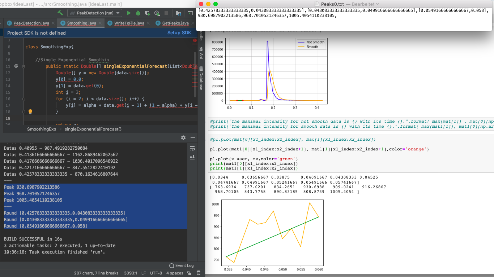

# Project description
The project's goal is to load and process raw data coming from a mass spectrometer with Java. The following main objectives are required:
• Use a smoothing algorithm to pre‐process the raw data
• Find the peak start and end point for each peak and report them in console and txt file - ains noisy data which is not usual and more an extreme example of raw data files.

# Material
I use the IntelliJ IDE. The main method shows how to read the raw data files (mzML files) and how to access the raw values. These values consist of retention time values (x axis in the examples below; “retentionTimes” array in the Java class) and the intensity values (y axis in the examples below; “intensities” array in the Java class).
I use the intensity values to find the peak start and end points and the peak start and end points are highlighted in green in the examples below.
I use three mzML files to implement the project: 1st file has the best data quality and should be used for implementation of the algorithm, 2nd file corresponds to an average sample and the quality of the data can vary greatly, 3th file for challenge the algorithm.

Each file consists of multiple chromatograms, which are graphs of intensity values over time (retention time). To access all the chromatograms, I refer to the project's main Java class.

# Examples
The graph below shows a „standard” peak: the x axis is the retention time, the y axis is the intensity and the title is the mass transition or “name” of the graph.

Such a graph can also be very noisy as mentioned in the previous section. The same mass transition in the 3th file is shown below:

There can also be case where multiple peaks are in the chromatogram and in such a case please try to find the peak start and end points for all peaks in the chromatogram. An example of a chromatogram having more than one peak is given below:

The same chromatogram in the noisy 3th file is shown below:

# Solution
Here I have tried to summarize the result. In IntelliJ IDE the peaks (with start and end area) are detected and output to the console as well as automatically saved in a .txt file (format see in the picture below). Furthermore the Smooth and Not Smooth chromatograms are saved in a .txt file (for further processing e.g. in Python). On the right side of the picture is the visualization of the result. Here it can be seen that for the area under consideration the peaks output in Java are actually the peaks we want. The code works fine. In addition, a Python code was developed for visualization/verification.

